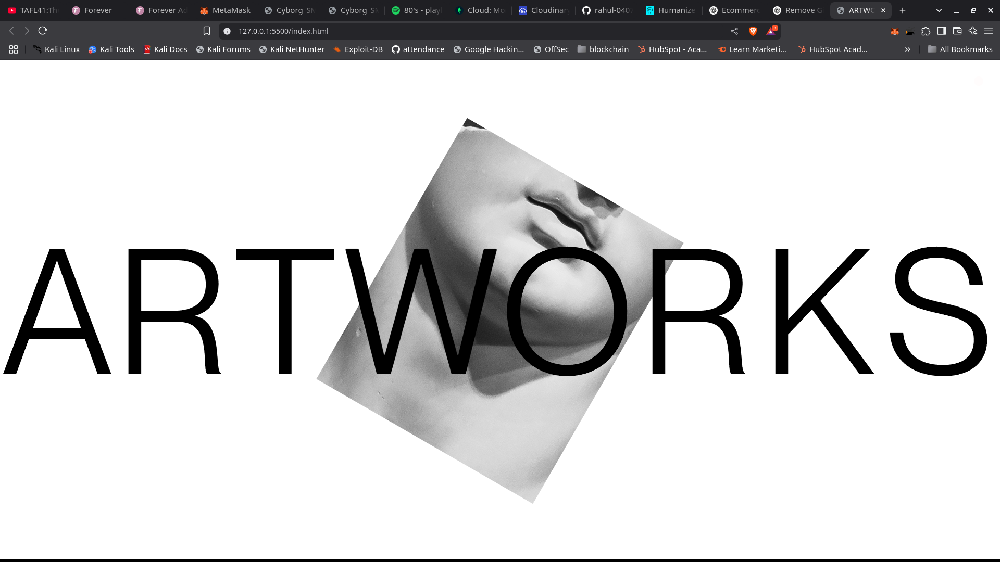
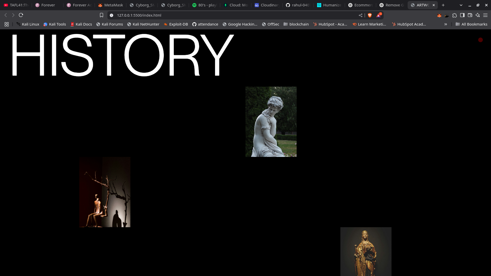
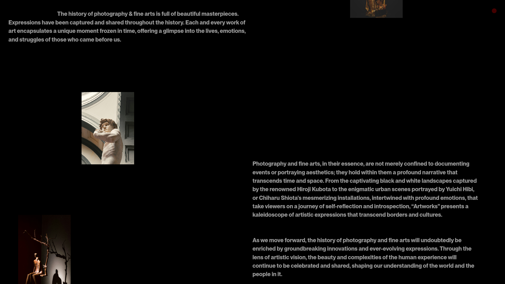
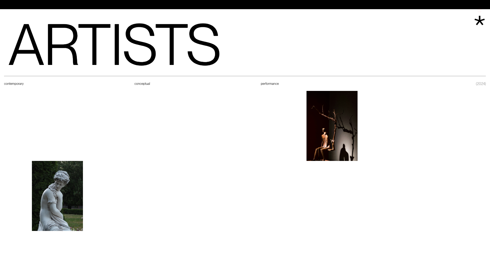

# 🎨 ARTWORKS

**ARTWORKS** is a visually rich, scroll-animated web project that explores the elegance and history of fine art, photography, and modern conceptual performances. Built using **HTML**, **CSS**, **JavaScript**, and **GSAP**, the site creates an immersive visual experience with smooth scroll interactions, fixed positioning, and dynamic animations.

## ✨ Features

- Fixed-position landing animation
- Scroll-triggered transitions using GSAP and ScrollTrigger
- Custom animated cursor
- Responsive layout using absolute and fixed positioning
- Minimal, artistic UI inspired by modern design
- Categorized content: `History`, `Artists`, `Conceptual`, `Performance`

## 🧱 Tech Stack

- HTML5
- CSS3
- JavaScript (ES6+)
- [GSAP](https://greensock.com/gsap/)
- [GSAP ScrollTrigger](https://greensock.com/scrolltrigger/)

## 🖼️ Screenshots

| Home | History 1 |
|------|-----------|
|  |  |

| History 2 | Artists |
|-----------|---------|
|  |  |
